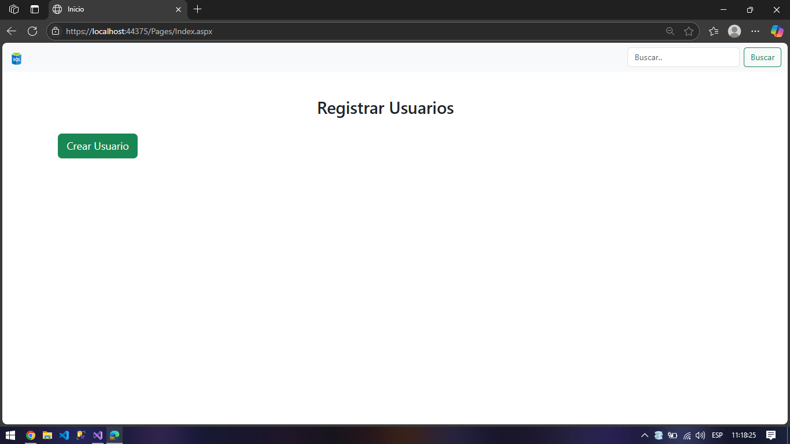
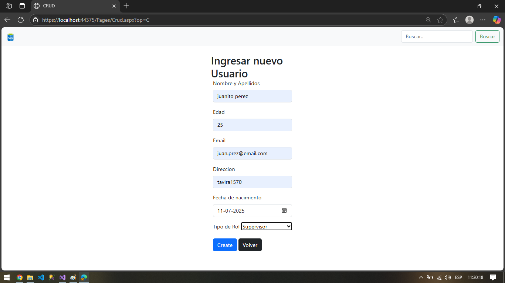
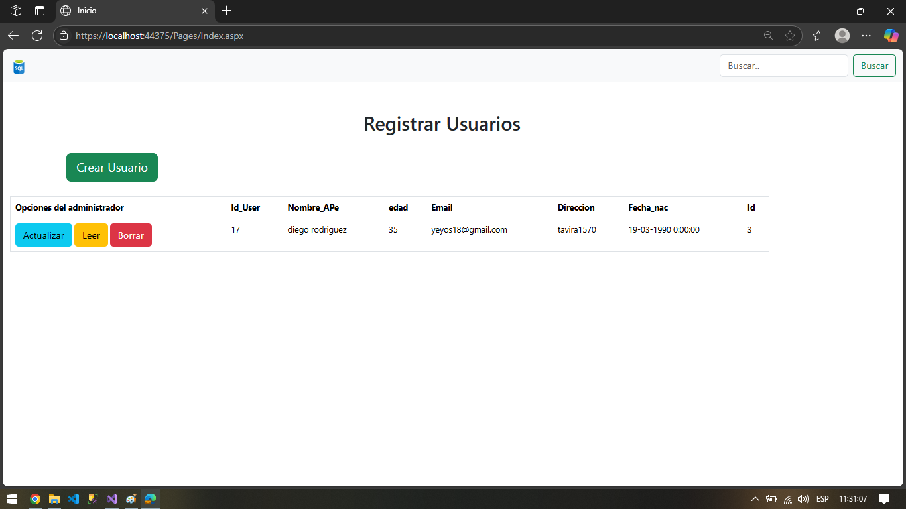

# Registro  de Usuarios con C#, ASP.NET y SQL Server


[](https://github.com/jonaaxsic)

[](https://github.com/jonaaxsic)


[](https://github.com/jonaaxsic)


## Descripción del Proyecto

Este proyecto es una aplicación web de tipo CRUD (Create, Read, Update, Delete) desarrollada en C# utilizando ASP.NET y una base de datos SQL Server. Permite gestionar usuarios, ofreciendo funcionalidades para registrar nuevos usuarios, visualizarlos, modificar su información y eliminarlos de la base de datos. Es una solución sencilla pero robusta para la administración básica de usuarios.

## Características

* **Registro de Usuarios:** Permite crear nuevos usuarios con su información personal (nombre, edad, email, dirección, fecha de nacimiento) y asignarles un rol.
* **Visualización de Usuarios:** Muestra una tabla con todos los usuarios registrados en la base de datos, incluyendo sus detalles y opciones de administración.
* **Actualización de Usuarios:** Facilita la edición de la información existente de un usuario.
* **Eliminación de Usuarios:** Permite borrar un usuario de la base de datos.
* **Base de Datos SQL Server:** Utiliza SQL Server para el almacenamiento persistente de los datos de los usuarios.
* **Interfaz Intuitiva:** Diseño de usuario claro y fácil de navegar.

## Tecnologías Utilizadas

* **Backend:** C# (.NET Framework / .NET Core, según tu configuración de Visual Studio)
* **Framework Web:** ASP.NET (Web Forms o MVC, asumiendo Web Forms por la extensión `.aspx` en las imágenes)
* **Base de Datos:** SQL Server
* **IDE:** Visual Studio

## Capturas de Pantalla

A continuación, se muestran algunas capturas de pantalla de la aplicación en funcionamiento:

### Página Principal (Inicio - Sin usuarios)

Esta es la vista inicial de la aplicación donde se presenta la opción para registrar un nuevo usuario.



### Página para Crear un Nuevo Usuario

Aquí se muestran los campos para ingresar la información del nuevo usuario y asignarle un rol.



### Página Principal (Inicio - Con usuario creado)

Después de crear un usuario, este se mostrará en la tabla principal con las opciones para actualizar o eliminar.



## Configuración y Ejecución del Proyecto

Para configurar y ejecutar este proyecto en tu entorno local, sigue los siguientes pasos:

1.  **Clonar el Repositorio:**
    ```bash
    git clone [https://github.com/jonaaxsic/Crud.git](https://github.com/jonaaxsic/Crud.git)
    ```

2.  **Abrir en Visual Studio:**
    Abre el archivo de solución (`.sln`) del proyecto en Visual Studio.

3.  **Configurar la Base de Datos SQL Server:**
    * Crea una base de datos en SQL Server (por ejemplo, `UsuariosDB`).
    * Crea una tabla para los usuarios (ejemplo de esquema básico):

        ```sql
        CREATE TABLE Usuarios (
            IdUser INT PRIMARY KEY IDENTITY(1,1),
            Nombre_APe NVARCHAR(255),
            Edad INT,
            Email NVARCHAR(255),
            Direccion NVARCHAR(255),
            Fecha_nac DATE,
            IdRol INT -- Si tienes una tabla de roles, sería una FK
        );
        ```
    * Actualiza la cadena de conexión en el archivo `Web.config` (o `appsettings.json` si es .NET Core) de tu proyecto para apuntar a tu base de datos SQL Server. Busca una sección similar a:

        ```xml
        <connectionStrings>
            <add name="DefaultConnection" connectionString="Data Source=YOUR_SERVER_NAME;Initial Catalog=YOUR_DATABASE_NAME;Integrated Security=True" providerName="System.Data.SqlClient" />
        </connectionStrings>
        ```
        Reemplaza `YOUR_SERVER_NAME` y `YOUR_DATABASE_NAME` con los valores de tu servidor y base de datos.

4.  **Compilar el Proyecto:**
    En Visual Studio, ve a `Build` > `Build Solution` o presiona `Ctrl+Shift+B`.

5.  **Ejecutar el Proyecto:**
    Presiona `F5` o haz clic en el botón `IIS Express` (o el servidor configurado) en Visual Studio para iniciar la aplicación web. Se abrirá en tu navegador predeterminado.


* **GitHub:** [jonaaxsic](https://github.com/jonaaxsic)
